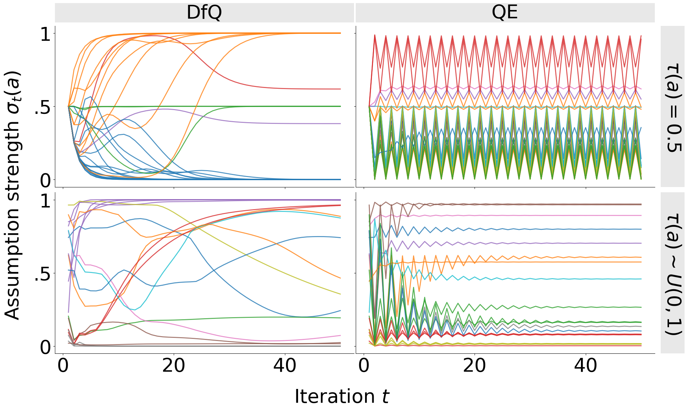

# GradualABA

A Python framework for **gradual semantics** in Assumption-Based Argumentation (ABA).  This repository provides the code for the paper "On Gradual Semantics for Assumption-Based Argumentation". 

It implements a variety of discrete gradual argumentation models over ABAFs, and builds on the core modular semantics and algorithms from [Uncertainpy](https://github.com/nicopotyka/Uncertainpy) (UP).

---

## 📖 Background

`Uncertainpy` is a Python library for computational argumentation that primarily supports **gradual (quantitative) argumentation**.  At a high level, solving a gradual argumentation problem involves:

1. **Picking a semantics model** (e.g. an energy-based or modular model).  
2. **Choosing an iterative algorithm** (an “approximator” like RK4) for cyclic graphs or a direct solver for acyclic ones.  
3. **Loading your argumentation graph** (BAG/BSAF/ABAF).  
4. **Computing strength values** until convergence (via step-size Δ and tolerance ε).  

Under the hood, most semantics repeatedly  
- **aggregate** the strength of attackers/supporters, and  
- **influence** each argument’s base score based on that aggregate, until the system stabilizes (or oscillates).

`GradualABA` re-uses and extends these modular aggregation & influence components, and adds support for ABAF-specific constructs, convergence checks, visualization, and example pipelines.

---

## 💡 Key Features

- **ABAF, BAG & BSAF support**  
  - Build and manipulate Assumption-Based Argumentation Frameworks (ABAF)  
  - Convert to Bipolar Argumentation Graphs (BAG) or Bipolar Set Argumentation Frameworks (BSAF) ready to apply semantics
- **Modular semantics**  
  - Discrete models (for both BAGs and BSAFs); Continuos only for BAGs
  - Swap aggregation (sum, product, etc) and influence (linear, quadratic, Euler) components
  - Additional aggregations (mean, asm) for BSAFs and BAG baselines
- **Convergence analysis**  
  - Per-argument and global checks (`has_converged`, `is_globally_converged`)  
- **Examples & notebooks**  
  - Ready-to-run examples in `examples/`  
  - Plot strength evolution over iterations

---

## 🚀 Installation

```bash
git clone https://github.com/yourusername/gradualABA.git
cd gradualABA

# (optional) create and activate a virtual environment
python3 -m venv gradaba
source gradaba/bin/activate

pip install -r requirements.txt
```

## 🏃‍♂️ Quickstart Example

The best way to get started is to go through the example notebook: [(examples/simple_demo_example.ipynb)](examples/simple_demo_example.ipynb)

There, we have the application of the ABAF gradual semantics based on BSAFs and BAGs for both Df-QuAD and QE. The process involves:
- Load an ABAF from file
- Convert ABAF to BSAF or BAF
- Chose your modules for
        - Aggregation
        - Influence
        - Attk/Supp or Base-Score Aggregations (for BSAFs and BAGs, respectively)
        - Assumption Aggregation (for BAGs only)
- Plot and check convergence

Example outputs trajectories when applying gradual ABA semantics:



Additionally, we have adapted the example notebook from UP to run also discrete semantics instead of continuous only:[(examples/reproduce_truth_example.ipynb)](examples/reproduce_truth_example.ipynb)

## 🔬 Reproduce Experiments in the paper

The experiments were run using the following command in the root folder:
```bash
python test_convergence.py
```
Note that only a subset of the parameters will be run automatically from this script, namely: Random Base Score Init, Product Set Aggregation and Mean Assumption Strength. Config options are provided at the top of the script and should be self explanatory. 

*Please note that the full run (as configured by default) will take hours to run.*

Results are saved in `convergence_results/` and [(convergence_results/plots.ipynb)](convergence_results/plots.ipynb) reproduces all the plots in the paper.

## 📂 Repo structure

```text
gradualABA/
|-- ABAF/                          # ABAF class
|-- BAG/                           # QBAF class (UP)
|-- BSAF/                          # BSAF class
|-- algorithms/                    # UP approximations for continuous semantics
|-- semantics/                     # semantics implementations
|   |-- modular/                   # modular: influence (UP), aggregation (UP), set-aggregation
|   |-- ContinuousModularModel.py  # for BAFs/BAGs (UP)
|   |-- QuadraticEnergyModel.py    # for BAFs/BAGs (UP)
|   |-- Model.py                   # for BAFs/BAGs (UP)
|   |-- bsafDiscreteModular.py     # for BSAFs
|   |-- DiscreteModularModel.py    # for BAFs/BAGs
|
|-- convergence_results/           # convergence run outputs & notebook with plots
|-- data_generation/               # scripts & data for generating ABAF inputs
|-- examples/                      # sample ABAF files & usage notebooks
|-- plotting/                      # plotting scripts
|-- constants.py                   # global constants
|-- tests.py                       # unit tests
|-- test_convergence.py            # convergence tests
|-- requirements.txt               # Python dependencies
|-- README.md                      # this file
```


## Reference
If you are using this code, please cite our paper
```
@misc{rapberger2025gradualaba,
      title={On Gradual Semantics for Assumption-Based Argumentation}, 
      author={Anna Rapberger and Fabrizio Russo and Antonio Rago and Francesca Toni},
      year={2025},
      eprint={2507.10076},
      archivePrefix={arXiv},
      primaryClass={cs.AI},
      url={https://arxiv.org/abs/2507.10076}, 
}
```
